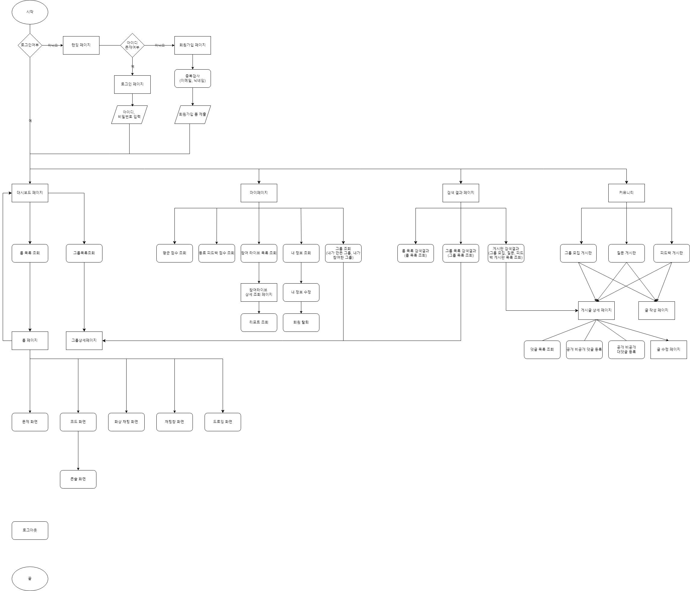
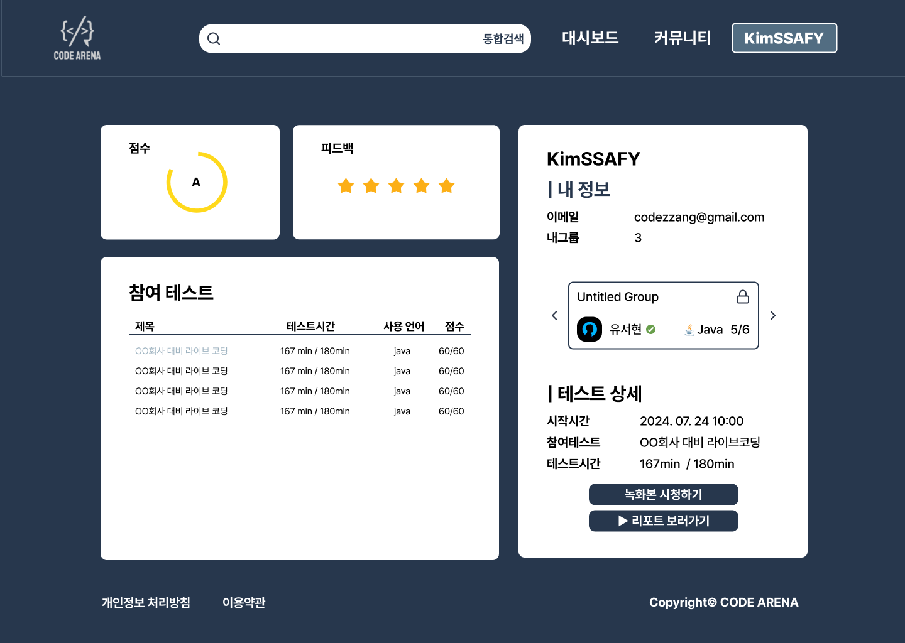
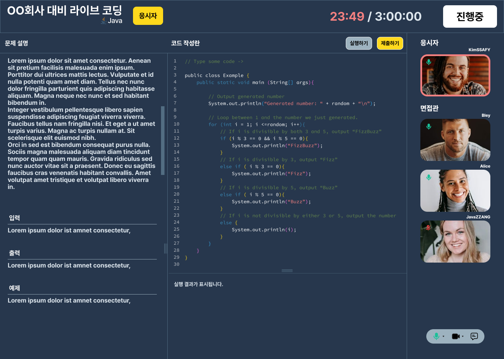
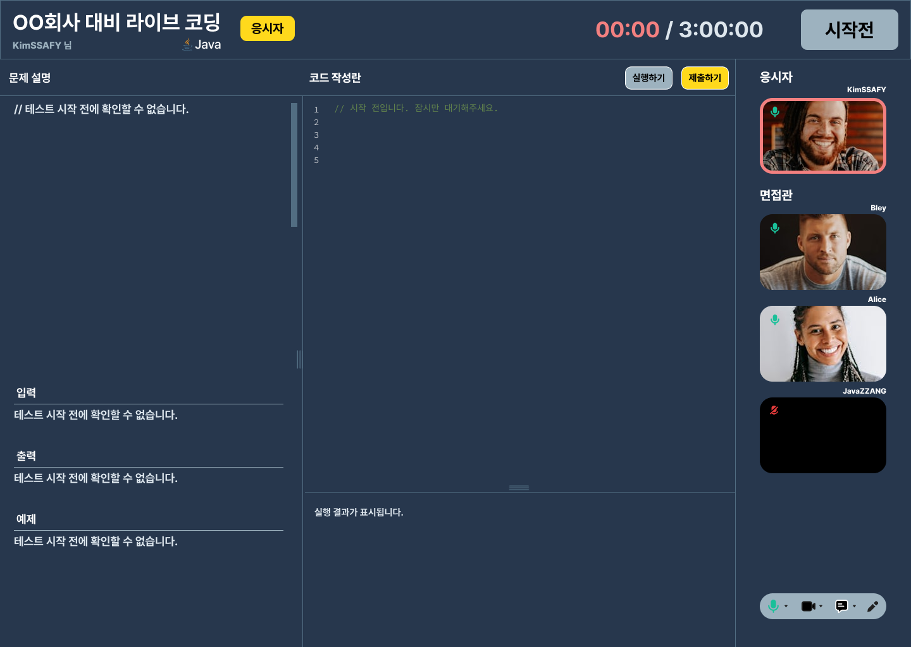
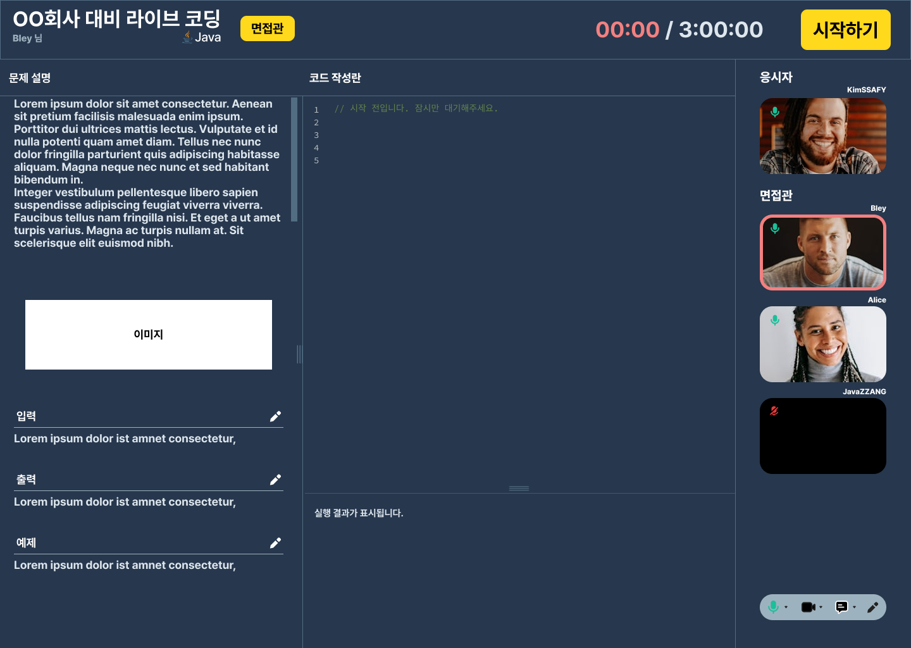
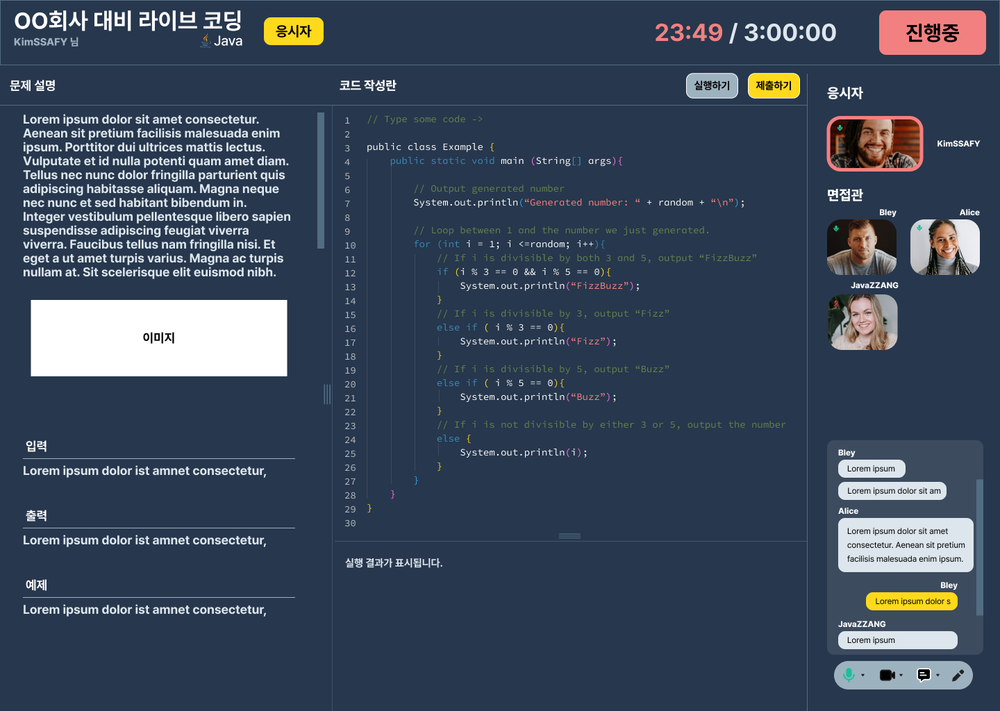
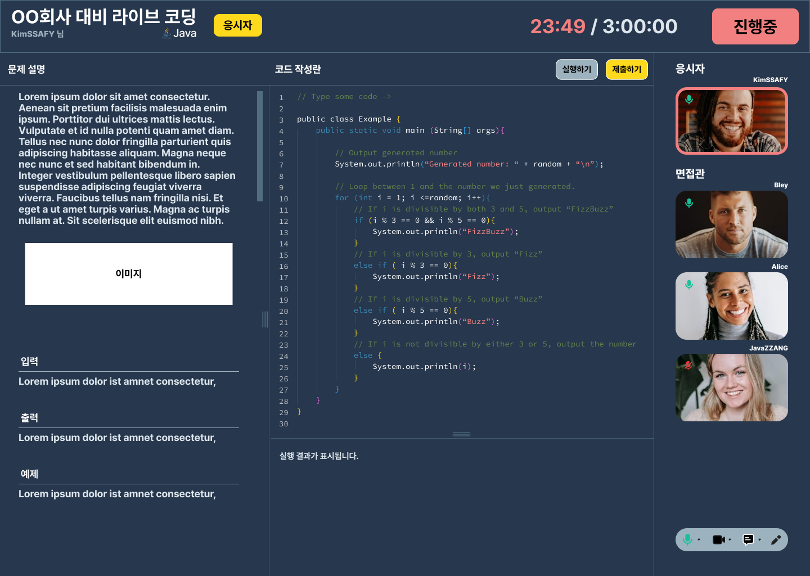

# WIL
- 프로젝트 명 : CODE ARENA
- 내 역할 : 프론트엔드
- 사용 기술 스택(예정) : React, next.js, Typescript, three.js
- 프로젝트 간단 소개 : '라이브 코딩 테스트'를 연습할 수 있는 플랫폼. 
 
## 1주차 작업 내용 - 페이지 기획 및 figma작업
### 1️⃣ 유저 플로우 차트

```
 [CODE ARENA에 진입했을 때 사용할 수 있는 기능과 기능에 따른 페이지를 중심으로 유저 플로우 차트 구성]
1. 먼저, 회원가입이 된 사용자의 경우 로그인을 하면 모든 기능을 이용할 수 있고, 회원가입을 하지 않은 사용자의 경우 헤더의 탭을 이용해 대시보드(방 목록, 그룹 목록),  커뮤니티(게시글 목록)에 접근할 수 있도록 하여 CODE ARENA가 어떤 사이트인지 탐방할 수 있도록 하였습니다. 이렇듯 정보 목록의 조회는 가능하지만, 세부적인 기능은 사용할 수 없도록 interceptor(React-router-dom guard)를 적용할 예정입니다. 

2. 로그인을 완료 한 사용자는 헤더의 탭을 통해 대시보드, 커뮤니티뿐만 아니라 통합검색페이지와 마이페이지에 진입할 수 있습니다. 각 탭의 기능은 다음과 같습니다.

3-1. 대시보드: 방 목록과 그룹 목록을 조회할 수 있습니다. 
- 방 목록은 현재 진행되고 있는 라이브코딩room과 시작 전 상태의 라이브코딩room을 출력합니다. '입장하기'를 누르면 생성된 방에 들어갈 수 있고, '생성하기'를 누르면 라이브 코딩 테스트를 연습할 수 있는 방이 생성됩니다. room에 들어가면 문제화면, 코드화면(에디터 및 터미널), 화상 채팅 화면, 채팅창 화면, 총 4부분으로 화면이 분할된 모습을 볼 수 있고, 드로잉 화면은 특정 버튼을 클릭시 모달로 출력할 예정입니다. 
- 그룹 목록은 스터디를 할 수 있는 그룹을 보여주며, 그룹상세페이지로 접근할 수 있습니다. 그룹 상세페이지에서는 해당 그룹의 인원, 사용 언어, 누적 스터디 시간, 소개말 등을 확인할 수 있습니다.

3-2. 커뮤니티: 헤더에서 `<select>`로 그룹 모집 게시판, 질문 게시판, 피드백 게시판을 선택할 수 있습니다. 각 게시판에 맞는 게시글 목록을 조회할 수 있고, 글 CRUD와 댓글(비공개/공개), 대댓글 CRUD를 지원할 예정입니다.

3-3. 검색결과페이지: 통합검색으로 키워드를 포함한 그룹 목록, 방 목록, 게시글 목록을 조회할 수 있습니다. 

3-4. 마이페이지: 내 정보(이름, 이메일, 생년월일)를 조회 및 수정할 수 있고, 테스트와 관련한 3가지 기능(테스트 평균 점수, 동료 평가 점수, 테스트상세)을 조회할 수 있습니다. 테스트 상세의 경우 참여한 테스트 목록을 조회하고, 목록 중 하나를 클릭하면 해당 테스트의 녹화본을 시청할 수 있고, AI 리포트를 조회할 수 있습니다. 
```


### 2️⃣ figma 작업
1. 랜딩 페이지
- 
```
랜딩 페이지에서는 목록 등 데이터를 조회할 수 없도록 하여 사용자의 피로감을 줄였습니다. 광고문구란은 아직 계획이지만 three.js를 사용하여 꾸밀 예정입니다. 회원가입과 둘러보기 버튼만 두어 웹사이트에 몰입할 수 있도록하고, 지원하는 언어를 나열하여 디자인했습니다. 추후 비즈니스가 확장된다면 제휴 회사나 업체의 이름을 적을 예정입니다. 화면을 아래로 스크롤하면 사이트의 기능을 간단히 소개하는 문구를 확인할 수 있습니다. 타겟이 명확한 사이트라 가볍게 사이트에 진입한 일반 사용자는 어렵게 느낄 수 있을 것 같아, 이 사이트의 목적과 기능을 알 수 있도록 소개 페이지를 넣었습니다. 
```
2. 마이 페이지
- 
```
마이페이지는 기능에 따라 4가지 컴포넌트를 두어 화면을 구성했습니다. 자세한 테스트 상세정보는 한 화면에 두지 않고 모달이나 다른 페이지(아직 확정되지 않았습니다.)로 진입할 수 있게 하여 화면의 피로도를 줄였습니다. 회원탈퇴기능은 마이페이지에서는 바로 찾아 볼 수 없고, 수정페이지에 진입해야 가능하도록 구성하여 회원탈퇴를 조금이나마 줄일 수 있도록 했습니다.  
```
3. room 화면
- 
```
room detail로 들어가기 전 간략하게 만들어본 룸 화면(라이브 코딩테스트 진행 화면)입니다. 중요 정보인 재목, 사용언어, 현재 사용자 이름, 타이머, 진행중 / 시작전 상태가 화면 상단에 크게 들어가있습니다. 아래에는 문제 설명화면과 코드 화면(에디터 및 터미널), 화상 채팅 화면 및 채팅창이 3부분으로 분할되어 있습니다. 문제 구상을 위한 드로잉 화면은 모달로 띄울 예정입니다. 
```
- 
```
라이브 코딩 테스트가 시작되기 전 응시자 입장에서 볼 수 있는 화면입니다. 
```
- 
```
라이브 코딩 테스트가 시작되기 전 면접관 입장에서 볼 수 있는 화면입니다.
```
- 
```
채팅창을 클릭했을 때 볼 수 있는 화면입니다.
```
- 
```
테스트 진행 중 응시자 입장의 화면입니다. (면접관도 동일합니다)
``` 

## ✨ 전체 느낀점 
```
UI/UX를 중점으로 페이지기획과 목업설계를 시작햇습니다. 화면 설계에서 레퍼런스를 많이 참고해서 비슷하지만 우리만의 차별점을 드러낼 수 있도록 하였습니다. 코딩테스트를 위한 사이트이기 때문에 컨셉 색부터 어두운 계열로 선택했습니다. 다만 아주 어두운 색보다는 살짝 밝은 느낌으로 가기 위해 남색 계열을 선택해 사용자의 피로도를 줄일 수 있도록 하였습니다. 또한 우리 사이트의 전체 컨셉을 '실명제`를 기반으로 선택하여, 후에 비즈니스 확장 측면에서 각 회사에 입사 지원을 위해서도 리포트가 쓰일 수 있도록 하였습니다. 다만 로그인하지 않은 사용자의 경우 실명 노출의 위험이 있으므로 김OO이렇게 마스킹 처리할 예정입니다. 이 외에도 많은 부분을 사용자 입장에서 고려하여 화면을 구성했는데, 아직 많이 부족한 것 같고 실제 개발을 하면서도 UX/UI적으로 불편한점이 있다면 충분한 고민을 통해 과감히 수정할 수 있도록 해야겠습니다. 
```

