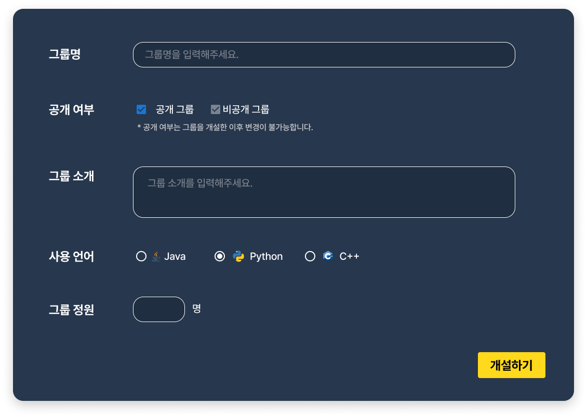

# Figma 목업

프로젝트의 초기 디자인은 Figma를 사용하여 작성되었습니다.

## 주요 화면 설명

**대시보드**

- 설명: 사용자가 로그인하면 처음 접하게 되는 화면입니다.

- 주요 기능: 개설된 방 목록, 그룹 목록을 표시합니다. 필터링 및 검색 기능도 제공합니다. 목록에서 호버 시 하늘색으로 강조됩니다.

**대시보드에서 방, 그룹 개설하기**

- 설명: 사용자가 새로운 방, 그룹을 생성할 수 있는 화면입니다.

- 주요 기능: 방 이름 입력, 공개/비공개 설정, 테스트 시간 설정, 사용 언어 설정, 입장 인원 설정, 그룹 소개 입력을 할 수 있습니다.

**게시판**

- 설명: 게시판의 모든 게시글을 목록으로 볼 수 있는 화면입니다.

- 주요 기능: 게시글 제목, 작성자, 작성 날짜, 조회수, 좋아요 수, 댓글 수를 표시합니다. 사용자는 게시글을 클릭하여 상세 내용을 볼 수 있습니다. 검색 기능과 정렬 필터가 제공됩니다. 목록에서 호버 시 밝은색으로 강조됩니다.

**검색 결과 페이지**

- 설명: 사용자가 특정 키워드를 검색했을 때의 결과를 표시하는 통합 검색 결과 화면입니다.

- 주요 기능: 검색어와 일치하는 방 목록, 그룹 목록, 게시글 목록을 표시합니다. 필터링 및 정렬 기능도 제공됩니다.

**게시글 상세조회 페이지**

- 설명: 선택한 게시글의 상세 내용을 볼 수 있는 화면입니다.

- 주요 기능: 게시글의 제목, 내용, 작성자, 작성 날짜, 조회수, 좋아요 수, 댓글 수를 표시합니다. 댓글 작성 및 조회 기능도 포함되어 있습니다.

**게시글 상세조회 페이지 - 댓글 수정, 삭제 화면**

- 설명: 자신이 작성한 댓글의 수정, 삭제가 가능한 메뉴를 제공합니다.

- 주요 기능: 자신이 작성한 댓글의 수정 또는 삭제가 가능합니다.

**글 작성 페이지**

- 설명: 새로운 게시글을 작성할 수 있는 화면입니다.

- 주요 기능: 제목 입력, 내용 작성 기능을 제공합니다. 작성한 글을 게시할 수 있습니다.
