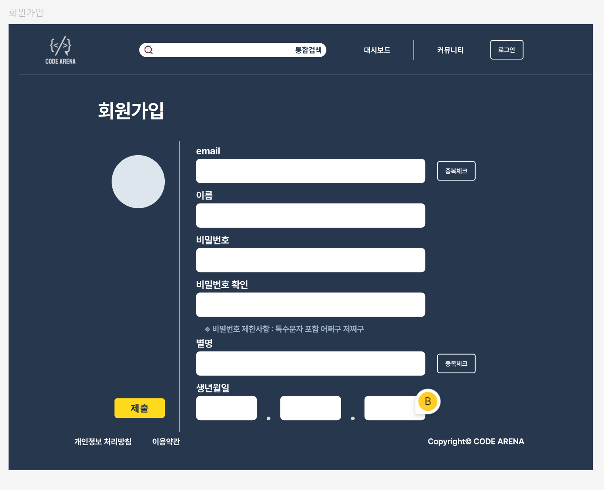
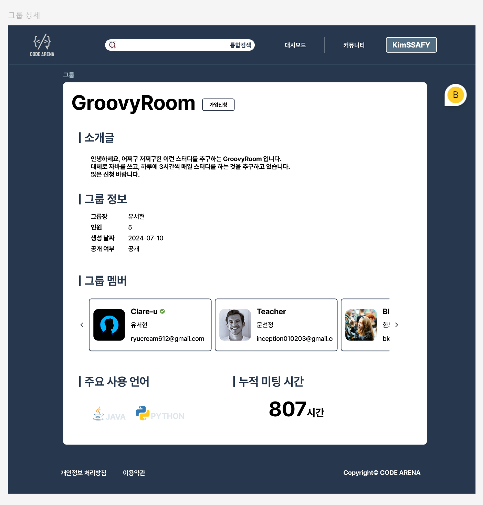

# README (한도형-1143772)

## 기능 명세 작성에 따른 화면 기획

[기능명세서 와 화면 분할](https://eggplant-network-0f5.notion.site/6cf6de3958244d36a26fa29b2f375d6b)

## 유저 플로우 차트

## Figma 목업

### 로그인

### 회원가입

### 그룹 상세 페이지

### 리포트 상세 페이지

## 느낀점

- 처음으로 프론트엔드를 전담하게 되어 어떻게 프로젝트를 성장할지에 대해 처음으로 고민해보았습니다.
    - 고민한 결과 UI / UX 측면에서 여러 토픽을 정해 해당 토픽에 맞게 디자인을 설계 수정하는 방식으로 작업하는 것으로 결정했습니다.
    - React를 처음 써보기 때문에 화면 구성, 데이터 흐름, 상태 관리, 라우팅 등의 기본에 충실함이 가장 우선이라고 목표를 정했습니다.

- Openvidu와 WebRTC 와 관련해 더 공부해 보면서 프로젝트의 방향성을 고민해야겠습니다.
    - React와 Kurento 연결
    - React와 Openvidu 사용
    - 위의 두 선택지 중에서 어떻게 할 지 공부하면서 가능성을 생각해야합니다.

