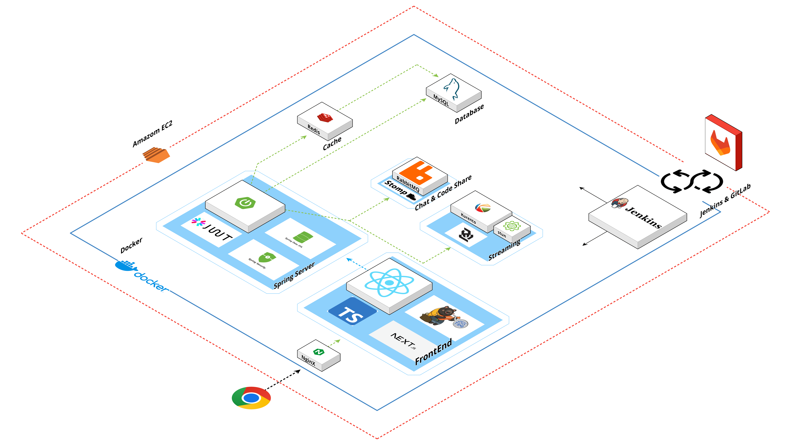
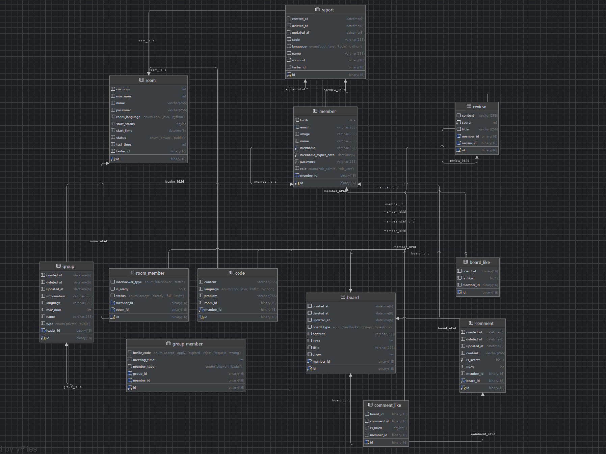

# Code Arena

### **“라이브 코딩 면접 대비 화상회의 플랫폼 Code Arena”**

https://i11a807.p.ssafy.io  
테스트 계정 : test@gmail.com  
테스트 계정 비밀번호 : Qwer1234!

## 프로젝트 소개

본 프로젝트에서는 라이브 코딩 테스트 플랫폼 구현을 목표로 화상회의, 실시간 채팅, 작성한 코드 동시 공유와 실행까지 필수 기능들을 제공합니다. 그 외 미팅 인원을 모으기 위한 그룹 기능, 다양한 자료를 공유할 수 있는 커뮤니티 기능을 포함하고 있으며, 개인의 코딩 테스트 데이터를 마이페이지와 레포트 페이지에서 종합해 볼 수 도 있습니다.

## 팀원 구성

| 한도형                      | 문선정                            | 손영준                       | 유서현                     | 진주원                        | 허동민                     |
| --------------------------- | --------------------------------- | ---------------------------- | -------------------------- | ----------------------------- | -------------------------- |
| https://github.com/Dohyungh | https://github.com/ssafy11thseoul | https://github.com/glenn-syj | https://github.com/clare-u | https://github.com/jinjoo-lab | https://github.com/hurdong |

## 1. 개발 환경

Front-end : React, Next.js, typescript, styled-component, Zustand  
Back-end : Spring Boot, JPA, MySQL, Redis, RabbitMQ, Kurento  
버전 및 이슈관리 : Gitlab, Jira  
협업 툴 : Notion, Mattermost  
서비스 배포 환경 : AWS EC2, Jenkins, Docker, NginX
디자인 : Figma  
개발 기간: 2024. 7. 5 ~ 2024. 8. 16 (6주)

## 2. 채택한 개발 기술과 브랜치 전략

### (프론트엔드)

### React, Next.js, Typescript, styled-component

- React
  - 컴포넌트화를 통해 추후 유지보수와 재사용성을 고려했습니다.
  - 유저 배너, 상단과 하단 배너 등 중복되어 사용되는 부분이 많아 컴포넌트화를 통해 리소스 절약이 가능했습니다.
- Next.js
  - Next의 앱 라우터 기능을 적극 활용하였으며, 대신 파라미터의 형식에 따라 예외처리를 해주었습니다.
  - ((미들웨어))
- Typescript
  - Function Component에 props와
  - Axios의 request, response 데이터의 타입지정으로 에러 발생시 원인지점을 쉽게 찾을 수 있었습니다.
- styled-component
  - props에 기반한 조건부 스타일링을 활용하여 동적으로 스타일을 적용시킬 수 있었습니다.
  - 컴포넌트 파일 내에 스타일이 포함되어 있어, 스타일과 구조를 함께 볼 수 있어 협업 시 가독성이 높았고, 스타일이 컴포넌트의 논리와 밀접하게 관련된 경우가 많아 특히 유용했습니다.

### zustand

- 최상위 컴포넌트를 만들어 props로 유저 정보를 내려주는 방식의 경우 불필요한 props 전달이 발생합니다. 따라서, 필요한 컴포넌트 내부에서만 상태 값을 가져다 사용하기 위해 상태 관리 라이브러리를 사용하기로 했습니다.
- Zustand는 Redux에 비해 상태 관리에 필요한 보일러플레이트 코드가 적고, 단순한 설정만으로도 애플리케이션의 상태 관리를 쉽게 구현할 수 있어 채택했습니다. 또한 `useStore` 훅을 사용하여 필요한 컴포넌트에서만 상태를 구독하고 사용할 수 있게 해주므로 불필요한 리렌더링을 방지하고, 상태 관리에 있어서 성능을 최적화할 수 있었습니다.

### eslint, prettier

- 정해진 규칙에 따라 자동적으로 코드 스타일을 정리해 코드의 일관성을 유지하고자 했습니다.
- 코드 품질 관리는 eslint에, 코드 포맷팅은 prettier에 일임해 사용했습니다.
- 협업 시 매번 컨벤션을 신경 쓸 필요 없이 빠르게 개발하는 데에 의의를 두었습니다.

### 브랜치 전략

- Github Flow: 6주 기간의 호흡으로 작업하며 일정상 마지막 주차에 배포가 이루어지기 때문에 채택하였습니다.

## 3. **프로젝트 구조**

- **Project Structure**

- **ERD**

## Front

- NginX로 사용자 요청이 들어옴

**React**

- 컴포넌트화를 통해 추후 유지보수와 재사용성을 고려
- 가상 DOM을 활용해 렌더링 최적화
- 외부 라이브러리와 호환성이 좋음 - 모나코에디터, 마크다운에디터, 웹소켓, 스톰프 등 다양한 라이브러리 사용 가능

**Next.js**

- 리액트의 함수형 컴포넌트와 훅 기반
- 각 페이지를 함수형 컴포넌트로 구현하여 프로젝트의 구조를 간결하게 유지.
- 서버 사이드 렌더링이나 정적 생성을 위한 데이터를 효율적으로 처리

**Typescript**

- 컴파일 시점에서 타입 체크를 시행하여 오류를 줄이고, 협업을 용이하게 하도록 사용

**Zustand**

- 불필요한 props drilling을 피하고, 필요한 컴포넌트 내부에서만 상태 값을 가져다 사용하기 위해 상태 관리 라이브러리 사용
- Redux에 비해 상태 관리에 필요한 보일러플레이트 코드가 적고, 단순한 설정만으로도 애플리케이션의 상태 관리를 쉽게 구현 가능

**Kurento-utils**

- WebRTCPeer 를 생성해주는 Kurento-utils 패키지를 이용해 프론트엔드에서 WebRTCPeer 객체를 생성하고, 해당 객체들간에 SDP(Session Descriptioㅇn Protocol) Offer와 Answer 를 주고 받음.
- 시그널링 서버를 통해 SDP 정보를 주고 받으면, 브라우저들 간에 WebRTCPeer Connection이 체결되고, Kurento Media Server를 사이에 두고 직접 비디오, 오디오 데이터를 주고 받는 것이 가능해짐.

### Back

**Spring**

- 백엔드 서버는 Spring Boot로 구축
  - 데이터 관리는 JPA 사용
  - 인증 인가 처리는 JWT와 Spring Security 사용

**Redis**

- Refresh Token은 redis에 캐싱하여 사용자 요청을 빠르게 처리 후 DB와 동기화
- 생성형 AI를 활용한 코딩 테스트 문제, 가장 최근 테스트 케이스 빌드 결과와 면접자의 마지막 제출 코드를 저장하여 빠르게 결과에 접근할 수 있게 해줌.

**Stomp & RabbitMQ**

- 테스터와 면접관 사이의 코드 공유, 터미널과 채팅은 STOMP 프로토콜 사용
  - 여기서 Spring 내장 메시지 브로커가 아닌 RabbitMQ 활용
  - Chat Queue, Terminal Queue, Code Queue, Problem Queue 4개의 큐를 사용
    - 단일 큐 이용 시 해당 메시지를 전부 구분해줘야 함
    - Terminal Queue, Problem Queue의 데이터 크기가 가장 크고 전송 과정에서 오랜 시간 요구 (많은 요청이 발생하지는 않는다)
    - Chat Queue, Code Queue는 실시간 성이 높음
    - 이러한 이유로 분리했다.

**Kurento & STUN & WebSocket**

- 화상회의를 위한 시그널링 서버는 Spring에 구축 후 SFU 방식 활용을 위한 미디어 서버로 Kurento 활용, 방화벽으로 인해 시그널링 정보를 받아오지 못하는 상황 고려하여 STUN 서버 구축
  - Kurento Media Server와의 통신을 위해 WebSocket 활용

### Infra

**AWS EC2**

- EC2 인스턴스 상에서 Jenkins 자동화를 이용한 빌드 및 배포 진행
- Letsencrypt를 통한 SSL 생성 및 적용

**Docker**

- Docker-compose 작성을 통해 도커 이미지 컨테이너 작성
- Docker 내 이미지 컨테이너 데이터 영속화 및 환경 설정을 위한 volume 폴더 설정

**Jenkins**

- Gitlab-Jenkins 연동을 통해 master 브랜치 관련 작업 시 자동 빌드 및 배포 진행
- Jenkins 자유형 프로젝트 내 ‘execute Shell’을 활용한 gitlab 연동
- Jenkins Credentials를 활용한 환경 파일, keystore 파일, docker-compose 및 application-prod 파일 보안 강화

**NginX**

- NginX를 리버스 프록시로 활용하여 백엔드 서버의 실제 IP 주소 및 포트 번호를 감추고 외부에서의 보안 강화
- Websocket 연결 및 STOMP 프로토콜에 맞게 NginX 설정 파일 작성

**TURN**

- 서로 다른 네트워크에서 NAT를 비롯한 여러 변수에 의해 브라우저끼리 직접 연결하기가 어려울 수 있음.
- 이를 보완하기 위해 중개 역할을 해주는 TURN 서버를 추가적으로 띄워 배포 환경에서도 Video/Audio 데이터 송출과 수신이 가능해짐.

## 4. 역할 분담

### 한도형

**프론트엔드**

- UI
  - 페이지 : 로그인, 회원가입, 룸 문제, 룸 화상 회의, 룸 인포, 레포트, 그룹 상세 페이지
  - 공통 컴포넌트 : 프로그램 언어, carousel,
- 기능
  - 로그인, 회원가입
  - 화상회의 WebRTC 구현
  - WebSocket을 이용한 ChatGPT 문제생성 시현
  - 룸 입,퇴장 로직 분기 처리 (면접관, 응시자, 시작 전/후)

### 문선정

**프론트엔드**

- UI
  - 페이지 : 랜딩페이지, 마이페이지, 룸 인포, 코드 편집기(모나코 에디터), 터미널(실행/제출 결과 표시), 단체 채팅
  - 공통 컴포넌트 : 헤더, 푸터
- 기능
  - 로그인 유지 및 로그아웃
  - 마이페이지: 내 정보 조회 · 참여 테스트 목록 조회 · 내 그룹 조회 · 평균 PASS비율 조회 · 동료 피드백 평균 별점 조회
  - 코드 편집기 코드 작성시 실시간 WebSocekt, STOMP 실시간 양방향 통신
  - 실행하기/ 제출하기 클릭시 터미널에 결과 출력 및 실시간 WebSocekt, STOMP 실시간 양방향 통신
  - 단체 채팅 WebSocekt, STOMP 실시간 양방향 통신

### 유서현

**프론트엔드**

- UI
  - 페이지 : 대쉬보드, 통합검색, 게시판, 게시글 작성, 게시글 수정, 게시글 상세, 회원정보 수정, 404 페이지
  - 공통 컴포넌트 : 글 작성 에디터, 버튼
- 기능
  - 게시글 등록 · 상세 조회 · 목록 조회 · 수정 · 좋아요, 통합검색, 검색
  - 댓글 등록 · 조회 · 수정 · 삭제 · 좋아요,
  - 레포트 등록 · 목록 조회 · 상세 조회
  - 회원정보 수정, 회원가입 및 회원정보 수정 페이지의 유효성 검사
  - 그룹 생성 · 목록 조회 · 상세 조회 · 수정 · 가입신청 · 수락 · 거절 · 강퇴 · 그룹장 변경

### 손영준

**백엔드**

- Infra
  - Docker-compose 및 Jenkins Credentials를 활용한 배포 환경 구축 및 분리
  - NginX 리버스 프록시 설정
  - WebSocket 연결 생성 및 STOMP 통신, Kurento를 위한 NginX 및 Docker 환경 설정
  - Jenkins 및 Shell Script 기반 AWS EC2-Gitlab 연동 CI/CD
- 기능
  - Spring Security를 활용한 JWT 인증 및 인가 기존 코드 개선
  - Spring Security 환경에 기반한 테스트 코드 작성
  - Redis hyperloglog를 이용한 게시글 좋아요 및 조회수 코드 개선

### 진주원

**백엔드**

- infra
  - Docker-compose를 통한 개발 환경 구축
  - RabbitMQ, WebSocekt, STOMP 설정 구축 및 config 작성
- 기능
  - kurento media server 구축 및 스트리밍 서버 구현
  - 그룹 생성, 가입, 초대, 변경, 삭제 로직 구현
  - 화상회의 생성, 초대, 정보 변경 구현

### 허동민

백엔드

- 기능
  - RabbitMQ + STOMP 실시간 코드 에디터 서버 구현
  - RabbitMQ AI 생성 문제 실시간 공유 서버, 실시간 코드 컴파일 결과 공유 서버 구현
  - STOMP 실시간 면접관, 면접자 소통 채팅 서버 구현
  - 게시글 생성, 수정, 조회, 삭제 및 게시글 좋아요 기능 구현
  - 댓글 생성, 수정, 조회, 삭제 및 댓글 좋아요 기능 구현
  - 레포트 생성, 조회 기능 구현

## 5. 페이지별 기능

### [랜딩 페이지]

- 서비스 접속 초기화면으로 서비스에 대한 간단한 소개를 제공합니다.

### [회원가입]

- 입력창에서 바로 유효성 검사가 진행되고 통과하지 못한 경우 경고 문구가 입력창 하단에 각각 표시됩니다.
- 모든 폼을 유효하게 입력해야 회원가입 진행이 가능합니다.
- 현재는 중복 검사 기능은 미구현입니다.

### [로그인]

- ID와 PW를 입력해 사용자가 로그인할 수 있습니다.
- 올바른 자격 증명을 입력하지 않으면 오류 메시지가 표시됩니다.

### [로그아웃]

- 사용자는 언제든지 로그아웃할 수 있으며, 로그아웃 시 로컬 저장소의 토큰 값과 사용자 정보를 삭제합니다.

### [대쉬보드]

- 메인 기능인 룸 목록과 그룹 목록이 나와 있으며 생성도 바로 가능합니다. 주요 기능들로 쉽게 접근할 수 있도록 구성되어 있습니다.

### [룸 생성하기]

- 응시자 역할로 참여할 사람이 방장이 되며, 사용자들이 실시간으로 모의 코딩 테스트 참여를 위해 방을 생성할 수 있습니다.

### [룸 대기 화면]

- 생성된 방에 다른 사용자들이 면접관 역할로 참여할 수 있으며, 대기 화면에서 참가자 리스트를 확인할 수 있습니다.
- 키워드를 통해 AI로 문제 생성이 가능하며, 문제 생성 단계에서는 면접관들의 논의를 위해 응시자의 듣기 기능과 말하기 기능을 끄는 것을 추천하는 안내 메세지가 나타납니다. 생성된 문제는 실시간으로 모든 면접관들에게 보여집니다.
- 모든 면접관들이 문제 생성과 논의를 마치고 준비 완료 상태가 되면 방장인 응시자가 시작 버튼을 눌러 모의 코딩 테스트를 시작합니다.

### [룸 진행중 화면]

- 생성된 문제가 응시자에게 보여지며, 지정된 타이머를 통해 시간 제한을 알려줍니다.
- 실행하기 버튼을 통해 작성한 코드를 실행해 볼 수 있으며, 제출하기 버튼을 통해 최종 코드를 제출합니다. 코드는 응시자만 작성 가능하며 면접관에게 실시간으로 보여집니다.
- 종료 버튼을 누르거나 타이머의 시간이 다 되면 종료 화면으로 이동됩니다.

### [룸 종료 화면]

- 결과 화면에서 면접관들은 테스트에 대한 피드백을 입력합니다. 100점 만점의 형태의 점수와 줄글의 피드백을 입력해야 합니다.
- 응시자에게는 레포트 생성까지 시간이 걸릴 수 있음을 안내합니다.

### [그룹 생성하기]

- 새로운 그룹을 생성하여 모집이 가능합니다.

### [그룹 상세 페이지]

- 그룹의 소개, 구성원, 가입 여부, 활동 내역 등을 한눈에 볼 수 있는 페이지입니다.
- 그룹장의 경우 가입 신청 목록을 조회하고 수락, 거절이 가능하며, 그룹 멤버에게 그룹장 위임 또는 강퇴가 가능합니다.
- 그룹원의 경우 그룹 탈퇴가 가능합니다.

### [마이페이지]

- 자신이 속한 그룹과 참여했던 테스트의 레포트를 확인 가능합니다.

### [마이페이지-내 정보 수정]

- 자신의 프로필 정보와 비밀번호를 수정할 수 있습니다.
- 별명의 경우 변경 후 1달간은 변경이 불가능합니다.

### [커뮤니티]

- 그룹 모집 게시판, 피드백 게시판, 질문 게시판의 3가지 게시판으로 분리되어 있습니다.
- 게시글 리스트
  - 각 게시판별 전체 글 목록을 확인할 수 있습니다. 10개 단위로 페이지네이션이 적용되었으며, 3가지 정렬 필터가 제공됩니다.
  - 하단 검색 바에서 게시글 검색이 가능합니다.
  - 게시글을 클릭하면 각 게시글의 상세페이지로 이동합니다.
  - 글 쓰기 버튼을 눌러 게시글 작성이 가능합니다.
- 게시글 상세
  - 게시글 수정, 삭제, 좋아요의 기능을 제공합니다. 마크다운 양식이 적용된 에디터와 뷰어 기능을 제공합니다.
- 댓글
  - 해당 글에 대한 댓글 작성, 수정, 삭제, 좋아요의 기능을 제공합니다.

### [통합검색]

- 전체 게시판에서 검색한 결과를 각 게시판별로 상위 5건을 보여줍니다.
- 더보기 버튼을 통해 각 게시판의 검색 결과로 이동 가능합니다.

## 6. 프로젝트 후기

### 한도형

OpenVidu 프레임워크 없이 직접 WebRTCPeer를 생성하고, Video Ref 객체를 생성해 연결하는 모든 과정에서 React의 훅과 lifecycle에 대해 배울 수 있었습니다. TypeScript와 Next.js의 장점을 온전히 녹여내지 못했던 점, 디자인과 UI/UX에 대한 고민이 만족할 만큼 깊지 못했던 점이 많이 아쉽습니다. 다음 프로젝트에서는 보다 더 높은 생산성을 발휘할 수 있었으면 좋겠습니다.

### 문선정

기획부터 개발까지 모든 과정을 좋은 팀원들과 함께 할 수 있어서 영광이었고, 덕분에 많이 성장할 수 있었습니다. 그 중에서도 프론트엔드 파트로써 특히 2가지 영역에 공을 많이 들였는데, 첫째, **[로그인 유지]**입니다. 먼저 user의 정보와 상태를 관리하는 `userStore`에 `zustand`의 미들웨어인 `persist` 를 적용하여, 상태를 영구적으로 저장할 수 있도록 처리하였고, `api.interceptors.request` 와 `api.interceptors.response` 를 활용해 모든 `api`요청 전 요청과 응답을 관리하여 로그인 상태를 유지할 수 있도록 처리했습니다. 이로써 로그인 상태를 계속 유지하는 데에는 성공했지만, 프론트엔드에서 가장 중요한 것이 상태 관리인만큼 혹시나 더 간편하고 강력한 방법은 없는지 추가적으로 공부할 필요성을 느꼈습니다. 다음으로 **[웹소켓, 스톰프, RabbitMQ를 활용한 실시간 통신]** 입니다. 사용자가 코드를 작성하는 모나코 에디터, 실행결과를 출력하는 터미널, 단체 채팅방 총 3가지를 실시간 통신할 수 있게 작업하였는데, 처음에는 백엔드 코드를 보는 것 부터 개념 이해까지 많이 어려웠지만, 하면 할수록 통신 구조가 어떻게 되는지 깊이 있게 공부할 수 있어 정말 뜻깊은 경험이었습니다. 다음에 기회가 된다면 사이드 프로젝트로 백엔드 코드까지 작성해볼 수 있도록 많이 공부해야겠습니다.

끝으로 팀원들과 협업하면서, 기획과 소통의 중요성을 다시 한번 깨닫게 되었고, 서로 작성한 코드를 리뷰하면서 굉장히 많이 배울 수 있었습니다. 더 성장해서 개발속도가 빨라진다면, 디자인과 UI/UX도 더 깊이 있게 고려해보고 싶습니다. 우리 7조, 너무너무 고맙고, 헤어지기 아쉬워요!

### 손영준

기존 팀에서 기획을 마무리하고 개발을 하던 중, 팀이 해체되어 새로 들어왔음에도 많은 배려를 해준 팀원들에게 감사합니다. 기획 단계에 참여하지 못했다는 아쉬움은 있지만, 오히려 기존에 작성된 코드를 개선하면서 배운 점도 많았습니다.

기존에 작성되어 있던 Spring Security 코드를 개선하고 완성하는 작업은 쉽지만은 않았습니다. 전반적인 Spring Security 인증 및 인가 흐름을 파악하기 위해 노력했습니다. 특히 Spring Security 공식문서를 읽으며, AuthenticationManager를 중심으로 인증 과정을 파악했던 일이 기억에 남습니다. 동시에 코드를 읽고 다른 팀원에게 질문하며, 어떠한 요구 사항에서 코드가 작성되었는지 살펴보고 코드의 중요도를 파악했습니다.

체계적인 학습과 함께 기존 개발자의 의도를 고민하며, 프로젝트 내 코드의 역할 파악이 새로운 코드 작성보다 중요함을 알게 되었습니다. 그 덕에 기존 흐름은 유지하되, 미진한 부분만 빠르게 작성해 회원 기능을 개선하고 구현해내었습니다.

또한, 처음으로 EC2부터 Docker, Nginx를 다루기도 했습니다. 일차적으로는 서비스를 배포하는 과정 자체에 집중했지만, 프로토콜과 같이 기존에 학습했던 네트워크 지식을 트러블 슈팅 과정에서 몸으로 경험할 수 있었습니다.

### 유서현

한 프로젝트를 완성하기 위해서는 개발만 해서는 안 된다는 것을, 특히 소통의 중요성을 몸소 느낄 수 있었던 소중한 기간이었습니다. 처음 프로젝트를 시작할 때는 각자 맡은 바를 충실히 수행하면 된다고 생각했지만, 실제로는 끊임없는 의견 교환과 조율이 프로젝트의 성패를 좌우한다는 것을 깨달았습니다.

기술적인 측면에서는 Zustand를 사용한 상태 관리가 큰 도움이 되었습니다. Redux에 비해 훨씬 간결한 설정으로 필요한 기능을 구현할 수 있었고, 상태 관리가 필요한 부분에만 정확히 적용할 수 있었던 점이 특히 인상적이었습니다. 이로 인해 코드의 가독성과 유지보수성이 크게 향상되었고, 개발 속도도 빠르게 유지할 수 있었습니다.

마지막으로, 프로젝트를 마무리하며 느낀 것은 문제 해결 능력의 중요성입니다. 예기치 못한 오류와 마주쳤을 때, 팀원들과 함께 머리를 맞대고 해결책을 찾는 과정은 매우 소중한 경험이었습니다. 이번 프로젝트를 통해 얻은 지식과 경험을 자양분삼아 더 나은 개발자가 되기 위해 고군분투 하겠습니다.

### 진주원

Kurento Media Server를 직접 제어하여 WebRTC를 구성하는 과정에서 동작 과정을 배웠습니다. 협업과 소통의 중요성을 알게 되는 중요한 계기가 되었습니다. 프로젝트를 진행하면서 개인의 능력도 중요하지만 팀과의 융합을 위한 소통 능력 또한 기르게 되었습니다. 이번 계기로 더 멋있는 개발자가 되기 위해 노력하겠습니다.

### 허동민

프로젝트를 진행하면서 기획부터 개발, 배포까지 프로세스를 거치며 개인적으로 개발자로써 성장할 수 있는 기회가 있어 좋았습니다. 또한 평소 해보고 싶었던 웹소켓 통신을 여러 서버로 구현하며 하고 싶었던 것을 구현하는 개발이 얼마나 즐거운지 몸소 체험할 수 있어서 좋았습니다. 팀원들과 함께 웃으며 개발하며 진정한 Happy Coding이 뭔지 알게 되었던 것 같습니다. 우리 7조 끝까지 가야겠죠~~
